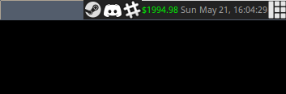

# Bitstamp Widget for Awesome 4.x

Awesome WM Bitstamp Widget! Simple as that. Ads a "last price" ticker to your Awesome panel to show you the current Bitcoin price.

## Installation

You have to insert pieces of example-rc.lua.txt into your ~/.config/awesome/rc.lua in order to make the code that actually updates your window manager work perfectly.

On completion you run the script `perl ./colour_seed.sh` and fork it to background (or add it to your `.xinitrc` file or something similar) and every N seconds your taskbar in Awesome WM will be updated with the latest Bitstamp value.

## Requirements

This is based on Arch Linux but will be similar across distros:

* Perl 5.x
* community/lua-sec
* aur/lua-dkjson
* aur/lua-posix
